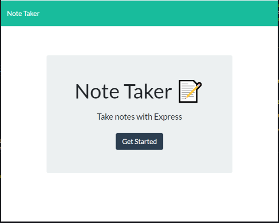
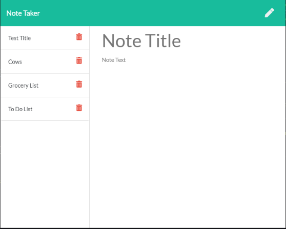
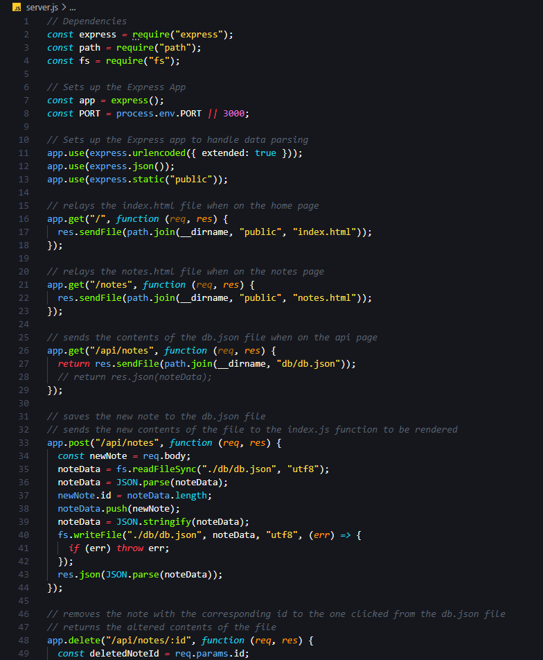
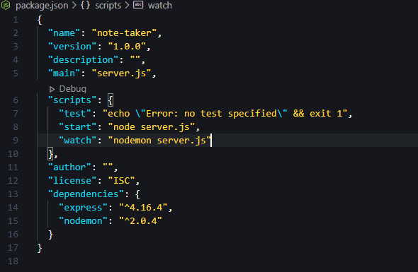

# Note Taker Application

This repository contains the code for a note application where the user can add and save notes, please see the [links](#Links) section to visit the deployed application.

---

## Table of Contents

- [Installation](#installation)
- [Usage](#Usage)
- [Building the Note Taker](#building-the-note-taker)
- [Acceptance Criteria](#acceptance-criteria)
- [Credits](#credits)
- [Resources](#resources)
- [Links](#Links)
- [License](#license)

---

## Installation

1. Follow the GitHub Repository Link in the [links](#Links) section below.
1. Clone the repository using an SSH key.
1. Open GitBash and use "git clone" to clone the repository.
1. Run npm install to install associated modules.

---

## Usage

Edit using VSCode after [installation](#installation). JavaScript, HTML, CSS and package.json files are included.

---

## Building the Team Profile Generator

Upon visiting the application, the user is presented with a home screen displaying a button to get started. Once the user clicks the 'Get Started' button, they are taken to a note page where they can either view old notes or enter a new note. If the user choses to view an old note, they simply have to click on the note that they wish to view and the note title and contents will display on the screen. If the user wishes to delete a note, they can click the trash icon and the note will be deleted. If the user wishes to write a new note, they can click the pencil icon on the top right of the window and enter details for their note. When the user begins typing, a save icon will also appear on the top right of the window. Once the user is done writing their note, they can simply click the save icon and their note will be saved.

Because the note is written to a db.json file when it is saved, the notes will persist for the user until they choose to delete them.

---

## Acceptance Criteria

Application should allow users to create and save notes. :heavy_check_mark:

Application should allow users to view previously saved notes. :heavy_check_mark:

Application should allow users to delete previously saved notes. :heavy_check_mark:

---

## Credits

As always, a huge thanks to our instructional staff for all their hard work!

## Resources

- [w3schools](https://www.w3schools.com)
- [Node.js](https://nodejs.org/en/)
- [Express](https://expressjs.com/)

---

## Links

[Repository Link](https://github.com/aimeecesler/note-taker-application)

[Deployed Application](https://note-taker-aimee-esler.herokuapp.com/notes)

---

## License

Copyright &copy; 2020 Aimee Corbin Esler

    Permission is hereby granted, free of charge, to any person obtaining a copy
    of this software and associated documentation files (the "Software"), to deal
    in the Software without restriction, including without limitation the rights
    to use, copy, modify, merge, publish, distribute, sublicense, and/or sell
    copies of the Software, and to permit persons to whom the Software is
    furnished to do so, subject to the following conditions:

    The above copyright notice and this permission notice shall be included in all
    copies or substantial portions of the Software.

    THE SOFTWARE IS PROVIDED "AS IS", WITHOUT WARRANTY OF ANY KIND, EXPRESS OR
    IMPLIED, INCLUDING BUT NOT LIMITED TO THE WARRANTIES OF MERCHANTABILITY,
    FITNESS FOR A PARTICULAR PURPOSE AND NONINFRINGEMENT. IN NO EVENT SHALL THE
    AUTHORS OR COPYRIGHT HOLDERS BE LIABLE FOR ANY CLAIM, DAMAGES OR OTHER
    LIABILITY, WHETHER IN AN ACTION OF CONTRACT, TORT OR OTHERWISE, ARISING FROM,
    OUT OF OR IN CONNECTION WITH THE SOFTWARE OR THE USE OR OTHER DEALINGS IN THE
    SOFTWARE.
